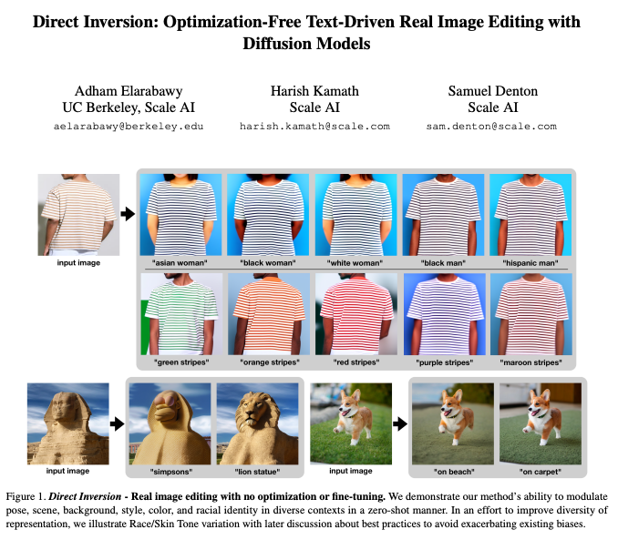
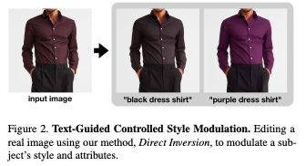
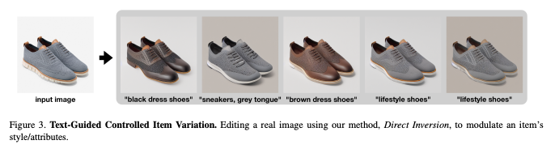

# Direct Inversion
Official code implementation for our paper, [Direct Inversion: Optimization-Free Text-Driven Real Image Editing with Diffusion Models](https://arxiv.org/abs/2211.07825).

## Abstract
With the rise of large, publicly-available text-to-image diffusion models, text-guided real image editing has garnered much research attention recently. Existing methods tend to either rely on some form of per-instance or per-task fine-tuning and optimization, require multiple novel views, or they inherently entangle preservation of real image identity, semantic coherence, and faithfulness to text guidance. In this paper, we propose an optimization-free and zero fine-tuning framework that applies complex and non-rigid edits to a single real image via a text prompt, avoiding all the pitfalls described above. Using widely-available generic pre-trained text-to-image diffusion models, we demonstrate the ability to modulate pose, scene, background, style, color, and even racial identity in an extremely flexible manner through a single target text detailing the desired edit. Furthermore, our method, which we name Direct Inversion, proposes multiple intuitively configurable hyperparameters to allow for a wide range of types and extents of real image edits. We prove our method's efficacy in producing high-quality, diverse, semantically coherent, and faithful real image edits through applying it on a variety of inputs for a multitude of tasks. We also formalize our method in well-established theory, detail future experiments for further improvement, and compare against state-of-the-art attempts.

## Quick Local Setup
1. Setup conda environment with all dependencies in [requirements.txt](requirements.txt).
2. Run [main.ipynb](main.ipynb).

## Modifying the codebase
All implementation is encapsulated inside [pipeline/direct_inversion_pipeline.py](pipeline/direct_inversion_pipeline.py), integrated with the diffusers package. If you'd like to port this implementation to another class of diffusion models (we use stable diffusion), feel free to follow the steps outlined in the comments of the pipeline file.

## More examples!

